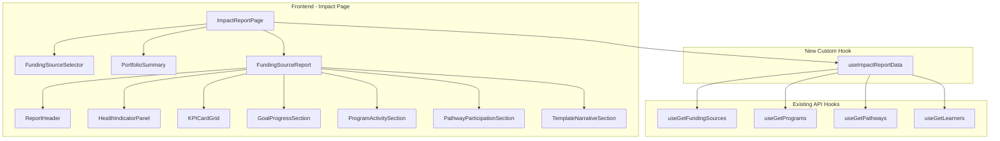

# Design Document: Funding Impact Report Redesign

## Overview

This design transforms the existing "Funding Source Report" tab (a flat hierarchical tree: Funder → Program → Pathway → Learner names) into an impact-oriented report answering "is this investment working?" The redesigned report is organized around progress, outcomes, and evidence — structured as: Funding Source → Health Status → KPIs → Goals → Programs → Pathways → Narrative.

The report uses only data from tables that are currently populated:
- `funding_sources` (11 records)
- `funding_source_goals` (48 records)
- `programs` (4 records, linked via `funderTag`)
- `pathways` (5 records, linked via `programCategory`)
- `learners` (11 records, linked via `program` field)

It does **not** use the empty join tables (`funding_source_learners`, `funding_source_programs`, `funding_source_pathways`) or empty learner detail tables (`learner_readiness_scores`, `learner_projects`, etc.). No AI/LLM service is required — the narrative is a deterministic template.

### Key Design Decisions

1. **Client-side computation**: All metrics (Progress_Rate, Time_Progress, Health_Indicator, KPIs, aggregates) are computed client-side from data already fetched via existing React Query hooks. This avoids a new API endpoint for the initial implementation since the data volume is small (11 funding sources, 4 programs, 48 goals).

   *Rationale*: The current data volume is trivial for client-side processing. More importantly, a database migration is anticipated in the near term. Keeping computation logic in pure TypeScript functions (rather than SQL queries, Postgres views, or server-side aggregation) means zero computation code needs to change when the database is swapped. If data volume grows significantly in the future, these same pure functions can be moved server-side behind an API endpoint without rewriting the logic itself.

2. **Association by name matching**: Programs link to Funding Sources via `programs.funderTag === fundingSource.name`. Pathways link via `pathways.programCategory === program.name`. Learners link via `learners.program === program.name`. No join table queries needed.

3. **Template narrative (no AI)**: The impact narrative is a deterministic string template populated with computed metrics. This eliminates external service dependencies and keeps the report fully functional offline.

4. **Component-per-section architecture**: Each report section is an independent React component, enabling collapsible panels, independent empty states, and clean print isolation.

5. **Session-persisted selector**: The funding source selector state uses `sessionStorage` to survive intra-app navigation.

6. **Print-first CSS**: Print styles use `@media print` rules to expand all sections, hide controls, and enforce single-column layout without JavaScript.

---

## Architecture



### Data Flow

1. `ImpactReportPage` calls `useImpactReportData()` custom hook
2. The hook internally calls existing hooks: `useGetFundingSources()`, `useGetPrograms()`, `useGetPathways()`, `useGetLearners()`, and fetches goals via `authFetch`
3. Once all data is loaded, the hook computes:
   - For each funding source: linked programs (funderTag match), linked pathways (programCategory match to linked programs), enrolled learners (sum of activeLearners from linked programs), goals, all KPIs, health status
   - Portfolio summary: totals across all funding sources
4. Returns `ImpactReportData` to the page component
5. Page renders portfolio summary (if "All") and individual sections based on selector

### New API Endpoint

One new endpoint is needed for funding source goals (currently fetched per-source):

#### `GET /api/funding-source-goals`

Returns all goals across all funding sources in a single request (avoids N+1 per funding source).

**Response:** `FundingSourceGoal[]` — same shape as existing per-source endpoint but for all sources.

**Implementation:** Simple `db.select().from(fundingSourceGoalsTable)` without a where clause.

This is the only new server route required. All other data comes from existing endpoints.

---

## Components and Interfaces

### New React Components

| Component | Location | Responsibility |
|-----------|----------|---------------|
| `ImpactReportPage` | `src/components/impact-report/ImpactReportPage.tsx` | Top-level orchestrator: data hook, selector, routing between portfolio and single view |
| `FundingSourceSelector` | `src/components/impact-report/FundingSourceSelector.tsx` | Dropdown with "All" + individual sources sorted by end date |
| `PortfolioSummary` | `src/components/impact-report/PortfolioSummary.tsx` | Aggregate KPIs across all funding sources |
| `FundingSourceReport` | `src/components/impact-report/FundingSourceReport.tsx` | Container rendering all sections for one funding source |
| `ReportHeader` | `src/components/impact-report/ReportHeader.tsx` | Identity, financials, timeline progress bar |
| `HealthIndicatorPanel` | `src/components/impact-report/HealthIndicatorPanel.tsx` | Traffic-light health status with pace/goal info |
| `KPICardGrid` | `src/components/impact-report/KPICardGrid.tsx` | 3-column (desktop) / 1-column (mobile) metric cards |
| `GoalProgressSection` | `src/components/impact-report/GoalProgressSection.tsx` | Sorted goal list with status icons and progress bar |
| `ProgramActivitySection` | `src/components/impact-report/ProgramActivitySection.tsx` | Linked programs table with aggregates |
| `PathwayParticipationSection` | `src/components/impact-report/PathwayParticipationSection.tsx` | Pathway cards with skills and milestones |
| `TemplateNarrativeSection` | `src/components/impact-report/TemplateNarrativeSection.tsx` | Generated narrative paragraph with copy button |
| `CollapsibleSection` | `src/components/impact-report/CollapsibleSection.tsx` | Reusable panel with expand/collapse toggle |
| `PrintHeader` | `src/components/impact-report/PrintHeader.tsx` | Print-only header (hidden on screen) |

### Utility Module

| File | Responsibility |
|------|---------------|
| `src/components/impact-report/computations.ts` | Pure functions for all metric computations (sort, health, KPIs, aggregates, template) |

### Modified Files

| File | Change |
|------|--------|
| `Impact.tsx` | Replace `funding-report` TabsContent with `<ImpactReportPage />` |
| `api-server/src/routes/funding-source-goals.ts` | Add `GET /api/funding-source-goals` (all goals) |
| `api-server/src/routes/index.ts` | Ensure goals route is registered (already is) |

### Custom Hook

```typescript
// src/components/impact-report/useImpactReportData.ts

interface UseImpactReportDataResult {
  isLoading: boolean;
  isError: boolean;
  data: ImpactReportData | null;
}

function useImpactReportData(): UseImpactReportDataResult {
  // Calls existing hooks + fetches all goals
  // Computes and returns ImpactReportData
}
```

### TypeScript Interfaces

```typescript
// src/components/impact-report/types.ts

interface ImpactReportData {
  fundingSources: FundingSourceReportData[];
  portfolio: PortfolioSummaryData;
}

interface PortfolioSummaryData {
  totalFundingAmount: number;
  totalLearnerTarget: number;
  totalEnrolledLearners: number;
  overallProgressRate: number | null;
  healthStatusCounts: {
    onTrack: number;
    atRisk: number;
    offTrack: number;
    notStarted: number;
    noTargets: number;
  };
}

interface FundingSourceReportData {
  id: number;
  name: string;
  amount: number | null;
  startDate: string | null;
  endDate: string | null;
  learnerCount: number | null;
  objectives: string | null;
  narrative: string | null;

  // Computed timeline
  timeProgress: number | null;   // 0-100, null if dates missing
  isExpired: boolean;
  isNotStarted: boolean;

  // Computed health
  enrolledLearners: number;      // sum of activeLearners from linked programs
  progressRate: number | null;   // enrolledLearners / learnerCount * 100
  healthStatus: HealthStatus;
  paceGap: number | null;        // progressRate - timeProgress

  // Goals
  goals: GoalData[];
  goalCompletion: { completed: number; total: number };

  // Programs
  programs: ProgramReportData[];
  programAggregates: ProgramAggregateData | null;

  // Pathways
  pathways: PathwayReportData[];

  // Narrative
  templateNarrative: string | null;  // null if insufficient data
}

type HealthStatus = 'on_track' | 'at_risk' | 'off_track' | 'not_started' | 'no_targets';

interface GoalData {
  id: number;
  title: string;
  status: 'not_started' | 'in_progress' | 'completed';
  note: string | null;
  documentFileName: string | null;
}

interface ProgramReportData {
  id: number;
  name: string;
  activeLearners: number;
  completionRate: number;
  readinessScore: number;
  eventParticipation: number;
  placementReady: number;
  startDate: string;
  endDate: string;
}

interface ProgramAggregateData {
  totalActiveLearners: number;
  weightedCompletionRate: number;  // weighted by activeLearners
  totalEventParticipation: number;
  totalPlacementReady: number;
}

interface PathwayReportData {
  id: number;
  name: string;
  estimatedWeeks: number;
  activeLearners: number;
  skills: string[];       // first 15 items
  milestoneCount: number;
}
```

---

## Data Models

No new database tables or columns required. All data derived from existing populated tables:

| Table | Fields Used | Association Method |
|-------|-------------|-------------------|
| `funding_sources` | name, amount, startDate, endDate, learnerCount, objectives, narrative | Primary entity |
| `funding_source_goals` | fundingSourceId, title, status, note, documentFileName | Direct FK to funding_sources |
| `programs` | name, funderTag, activeLearners, completionRate, readinessScore, eventParticipation, placementReady, startDate, endDate | `funderTag` matches `funding_sources.name` |
| `pathways` | name, programCategory, estimatedWeeks, activeLearners, skills, milestones | `programCategory` matches `programs.name` |
| `learners` | program, progress, readiness, status, flaggedForSupport | `program` matches `programs.name` (used only for future expansion reference) |

### Computation Logic (Pure Functions in `computations.ts`)

#### `sortFundingSources(sources: FundingSource[]): FundingSource[]`
```
Sort by endDate ascending (nulls last), then by name ascending (case-insensitive).
```

#### `computeTimeProgress(startDate: string | null, endDate: string | null, today: Date): { value: number | null; isExpired: boolean; isNotStarted: boolean }`
```
if (!startDate || !endDate) → { value: null, isExpired: false, isNotStarted: false }
totalDays = differenceInDays(endDate, startDate)
if (totalDays <= 0) → { value: 100, isExpired: true, isNotStarted: false }
if (today < startDate) → { value: 0, isExpired: false, isNotStarted: true }
if (today > endDate) → { value: 100, isExpired: true, isNotStarted: false }
elapsedDays = differenceInDays(today, startDate)
value = Math.round((elapsedDays / totalDays) * 100)
return { value, isExpired: false, isNotStarted: false }
```

#### `computeHealthStatus(progressRate: number | null, timeProgress: number | null, learnerCount: number | null, goalCount: number, isNotStarted: boolean): HealthStatus`
```
if (isNotStarted) → 'not_started'
if (learnerCount == null && goalCount === 0) → 'no_targets'
if (progressRate == null || timeProgress == null) → use goal-only heuristic or 'no_targets'
gap = timeProgress - progressRate
if (gap <= 0) → 'on_track'
if (gap <= 20) → 'at_risk'
return 'off_track'
```

#### `computeGoalCompletion(goals: GoalData[]): { completed: number; total: number }`
```
completed = goals.filter(g => g.status === 'completed').length
total = goals.length
```

#### `sortGoals(goals: GoalData[]): GoalData[]`
```
Priority order: in_progress = 0, not_started = 1, completed = 2
Stable sort by priority, preserving original order within groups.
```

#### `computeProgramAggregates(programs: ProgramReportData[]): ProgramAggregateData | null`
```
if (programs.length < 2) → null (no aggregates for 0 or 1 program)
totalActiveLearners = sum(programs.map(p => p.activeLearners))
weightedCompletionRate = Math.round(
  sum(programs.map(p => p.completionRate * p.activeLearners)) / totalActiveLearners
)
totalEventParticipation = sum(programs.map(p => p.eventParticipation))
totalPlacementReady = sum(programs.map(p => p.placementReady))
```

#### `filterProgramsByFunder(programs: Program[], funderName: string): ProgramReportData[]`
```
return programs.filter(p => p.funderTag === funderName)
```

#### `filterPathwaysByPrograms(pathways: Pathway[], programNames: string[]): PathwayReportData[]`
```
return pathways.filter(pw => programNames.includes(pw.programCategory))
  .map(pw => ({
    ...pw,
    skills: (pw.skills || []).slice(0, 15),
    milestoneCount: (pw.milestones || []).length,
  }))
```

#### `generateTemplateNarrative(data: FundingSourceReportData): string | null`
```
if (data.programs.length === 0 && data.goalCompletion.completed === 0) → null

Template:
"{name} has allocated ${amount} to support {learnerCount} learners over {duration} months.
As of {today}, {enrolledLearners} learners are enrolled across {programCount} programs,
representing a {progressRate}% enrollment rate against target. {goalCompleted} of
{goalTotal} funding goals are complete ({goalRate}%). Linked programs show an average
completion rate of {avgCompletion}% with {placementReady} learners at placement-ready
status."

- Omit sentences where data is null/unavailable
- Cap at 200 words (trim trailing sentences if exceeded)
```

#### `computePortfolioSummary(sources: FundingSourceReportData[]): PortfolioSummaryData`
```
totalFundingAmount = sum(sources.map(s => s.amount ?? 0))
totalLearnerTarget = sum(sources.map(s => s.learnerCount ?? 0))
totalEnrolledLearners = sum(sources.map(s => s.enrolledLearners))
overallProgressRate = totalLearnerTarget > 0
  ? Math.round((totalEnrolledLearners / totalLearnerTarget) * 100)
  : null
healthStatusCounts = count by healthStatus across all sources
```

---

## Text Wireframes

### 1. Portfolio Summary View ("All Funding Sources" selected)

```
┌─────────────────────────────────────────────────────────────────────────┐
│ Funding Impact Report                                        [Print ▼]  │
│                                                                         │
│ ┌───────────────────────────────────────────────┐                       │
│ │ All Funding Sources                         ▼ │                       │
│ └───────────────────────────────────────────────┘                       │
├─────────────────────────────────────────────────────────────────────────┤
│ PORTFOLIO OVERVIEW                                                       │
│                                                                         │
│ ┌─────────────────┐  ┌─────────────────┐  ┌─────────────────┐         │
│ │ Total Funding    │  │ Learner Target   │  │ Enrolled         │         │
│ │ $1,250,000.00   │  │ 150 learners     │  │ 98 learners      │         │
│ │ (funding_sources │  │ (SUM learner     │  │ (SUM activeLrn   │         │
│ │  .amount SUM)   │  │  Count)          │  │  from programs)  │         │
│ └─────────────────┘  └─────────────────┘  └─────────────────┘         │
│ ┌─────────────────┐  ┌─────────────────┐  ┌─────────────────┐         │
│ │ Progress Rate    │  │ 🟢 On Track      │  │ 🟡 At Risk       │         │
│ │ 65%             │  │ 7 sources        │  │ 2 sources        │         │
│ │ (enrolled /     │  │                  │  │                  │         │
│ │  target)        │  │                  │  │                  │         │
│ └─────────────────┘  └─────────────────┘  └─────────────────┘         │
├─────────────────────────────────────────────────────────────────────────┤
│ [Individual Funding Source sections follow below, separated by spacing] │
└─────────────────────────────────────────────────────────────────────────┘
```

**Desktop (≥1024px):** KPI cards in 3-column grid.
**Mobile (<1024px):** KPI cards stacked single-column.
**Empty state:** "No funding sources are associated with this account."

---

### 2. Report Header

```
┌─────────────────────────────────────────────────────────────────────────┐
│ 💼 Gates Foundation Youth Tech Grant                                     │
│                                                                         │
│ ┌────────────────────────────────────────────────────────────────────┐  │
│ │ Amount         │ Target        │ Start          │ End              │  │
│ │ $500,000.00    │ 75 learners   │ Jan 1, 2025    │ Dec 31, 2025    │  │
│ │ (funding_      │ (funding_     │ (funding_      │ (funding_       │  │
│ │  sources.      │  sources.     │  sources.      │  sources.       │  │
│ │  amount)       │  learnerCount)│  startDate)    │  endDate)       │  │
│ └────────────────────────────────────────────────────────────────────┘  │
│                                                                         │
│ Timeline: ████████████████░░░░░░░░░░ 58%  (212 of 365 days)            │
│           [Progress component, value from computeTimeProgress()]         │
│                                                                         │
│ Objectives:                                                             │
│ Provide technology career training to underserved youth in Atlanta.     │
│ (funding_sources.objectives — full text)                                │
│                                                                         │
│ Narrative:                                                              │
│ This grant funds cohort-based programs focused on workforce readiness.  │
│ (funding_sources.narrative — shown only when non-null)                  │
└─────────────────────────────────────────────────────────────────────────┘
```

**Variants:**
| Condition | Display |
|-----------|---------|
| `endDate` < today | Replace progress bar with `Badge: "Expired"` |
| `startDate` > today | Progress bar at 0%, label: "Not Started" |
| `startDate` or `endDate` null | No progress bar, text: "Dates not set" |
| `amount` null | Display "N/A" |
| `learnerCount` null | Display "N/A" |
| `narrative` null | Omit narrative section entirely |

**Desktop:** Fields in horizontal row (4 columns). Progress bar full width below.
**Mobile:** Fields stacked 2-per-row. Progress bar full width.

---

### 3. Health Indicator Panel

```
┌─────────────────────────────────────────────────────────────────────────┐
│ ▸ Health Status                              [CollapsibleSection]        │
│                                                                         │
│   ┌────────────────────────────────────────────────────────────────┐   │
│   │ 🟢 On Track                                                    │   │
│   │                                                                │   │
│   │ Enrollment Pace                                                │   │
│   │ Enrolled: 52 learners (from programs.activeLearners sum)       │   │
│   │ Target:   75 learners (from funding_sources.learnerCount)      │   │
│   │ Rate:     69% (Progress_Rate)                                  │   │
│   │ Timeline: 58% elapsed (Time_Progress)                          │   │
│   │ Pace:     +11 points ahead of schedule                         │   │
│   │                                                                │   │
│   │ Goals                                                          │   │
│   │ 3 of 5 goals completed (from funding_source_goals)             │   │
│   └────────────────────────────────────────────────────────────────┘   │
└─────────────────────────────────────────────────────────────────────────┘
```

**Color + text label mapping:**
| Status | Color | Text | Condition |
|--------|-------|------|-----------|
| On Track | Green (`text-emerald-600 bg-emerald-50`) | "On Track" | progressRate ≥ timeProgress |
| At Risk | Amber (`text-amber-600 bg-amber-50`) | "At Risk" | 0 < gap ≤ 20 |
| Off Track | Red (`text-red-600 bg-red-50`) | "Off Track" | gap > 20 |
| Not Started | Gray (`text-gray-600 bg-gray-50`) | "Not Started" | today < startDate |
| No Targets | Gray (`text-gray-500`) | "No Targets Defined" | null learnerCount AND 0 goals |

**Variants:**
- No learnerCount: Omit pace section, show only goal completion
- No targets at all: Show "No Targets Defined" message in neutral gray
- Expired: Append `[Expired]` badge next to status, use final pace at timeProgress=100%

---

### 4. KPI Card Grid

```
┌─────────────────────────────────────────────────────────────────────────┐
│ ▸ Key Metrics                                [CollapsibleSection]        │
│                                                                         │
│ ┌─────────────────────┐ ┌─────────────────────┐ ┌─────────────────────┐│
│ │ Enrolled Learners   │ │ Progress Rate       │ │ Goal Completion     ││
│ │ 52                  │ │ 69%                 │ │ 60%                 ││
│ │ SUM(programs.       │ │ enrolled /          │ │ completed /         ││
│ │ activeLearners)     │ │ learnerCount × 100  │ │ total goals × 100   ││
│ └─────────────────────┘ └─────────────────────┘ └─────────────────────┘│
│ ┌─────────────────────┐ ┌─────────────────────┐ ┌─────────────────────┐│
│ │ Avg Completion Rate │ │ Avg Readiness Score │ │ Placement Ready     ││
│ │ 67%                 │ │ 72%                 │ │ 8                   ││
│ │ MEAN(programs.      │ │ MEAN(programs.      │ │ SUM(programs.       ││
│ │ completionRate)     │ │ readinessScore)     │ │ placementReady)     ││
│ └─────────────────────┘ └─────────────────────┘ └─────────────────────┘│
└─────────────────────────────────────────────────────────────────────────┘
```

**KPI definitions:**
| KPI | Source | Formula | Null behavior |
|-----|--------|---------|---------------|
| Enrolled Learners | `programs.activeLearners` | SUM across linked programs | "0" if no programs linked, "N/A" if no programs exist |
| Progress Rate | enrolled / `funding_sources.learnerCount` | `round(sum / target × 100)` | "N/A" if learnerCount null |
| Goal Completion | `funding_source_goals` | `round(completed / total × 100)` | "N/A" if 0 goals |
| Avg Completion Rate | `programs.completionRate` | `round(mean)` | "N/A" if no programs |
| Avg Readiness Score | `programs.readinessScore` | `round(mean)` | "N/A" if no programs |
| Placement Ready | `programs.placementReady` | SUM | "N/A" if no programs |

**Desktop (≥1024px):** `grid-cols-3 gap-4`
**Mobile (<1024px):** `grid-cols-1 gap-3`
**Component:** Uses shadcn/ui `Card` with `CardContent` for each KPI.

---

### 5. Goal Progress Section

```
┌─────────────────────────────────────────────────────────────────────────┐
│ ▸ Funding Goals                              [CollapsibleSection]        │
│                                                                         │
│   ████████████░░░░░░░░ 3 of 5 goals completed                          │
│   [Progress component: value = completed/total × 100]                   │
│                                                                         │
│   🔄 Develop employer partnerships                                      │
│      "Meeting with 3 employers scheduled for Q3"                        │
│      (funding_source_goals: status=in_progress, note shown)             │
│                                                                         │
│   ○  Launch alumni mentorship program                                   │
│      (status=not_started, no note → note area omitted)                  │
│                                                                         │
│   ○  Create post-placement support guide                                │
│      📎 support-guide-v2.pdf  [download link]                           │
│      (status=not_started, documentFileName present)                     │
│                                                                         │
│   ✓  Complete first cohort graduation                                   │
│      "12 learners graduated June 2025"                                  │
│      (status=completed, note shown)                                     │
│                                                                         │
│   ✓  Achieve 50% enrollment target                                      │
│      (status=completed, no note → note area omitted)                    │
│                                                                         │
│   Empty state: "No goals defined for this funding source."              │
└─────────────────────────────────────────────────────────────────────────┘
```

**Sort order:** `in_progress` (🔄 Loader2 icon) → `not_started` (○ Circle icon) → `completed` (✓ CheckCircle2 icon)
**Document link:** Triggers download via existing `GET /api/funding-sources/:id/goals/:goalId/document`
**Desktop/Mobile:** Same layout — single column list. Touch targets ≥44px on icons/links.

---

### 6. Program Activity Section

```
┌─────────────────────────────────────────────────────────────────────────┐
│ ▸ Program Activity                           [CollapsibleSection]        │
│                                                                         │
│   AGGREGATE (shown only when ≥2 programs)                               │
│   Total: 52 learners │ 67% completion │ 142 events │ 8 placement-ready │
│                                                                         │
│   ┌──────────────────────────────────────────────────────────────────┐  │
│   │ Program             │ Learners │ Completion │ Readiness │ Events │  │
│   ├──────────────────────────────────────────────────────────────────┤  │
│   │ Tech Career Launch  │    34    │    71%     │    75     │   89   │  │
│   │ Jan 15 – Dec 15, 2025                                           │  │
│   ├──────────────────────────────────────────────────────────────────┤  │
│   │ Data Ops Starter    │    18    │    58%     │    68     │   53   │  │
│   │ Mar 1 – Nov 30, 2025                                            │  │
│   └──────────────────────────────────────────────────────────────────┘  │
│                                                                         │
│   Empty state: "No programs associated with this funding source."       │
└─────────────────────────────────────────────────────────────────────────┘
```

**Source:** `programs` where `funderTag === fundingSource.name`
**Aggregates (only when ≥2 programs):**
- Total Active Learners: SUM(activeLearners)
- Weighted Completion: ROUND(SUM(completionRate × activeLearners) / SUM(activeLearners))
- Total Events: SUM(eventParticipation)
- Total Placement Ready: SUM(placementReady)

**Desktop:** Full table with all columns.
**Mobile:** Each program as a `Card` component with fields stacked vertically. Table columns visible: Name, Learners, Completion (priority 3). Remaining metrics inside card body.

---

### 7. Pathway Participation Section

```
┌─────────────────────────────────────────────────────────────────────────┐
│ ▸ Pathway Participation                      [CollapsibleSection]        │
│                                                                         │
│   ┌──────────────────────────────────────────────────────────────────┐  │
│   │ Full Stack Development                                            │  │
│   │ 16 weeks • 12 active learners • 8 milestones                     │  │
│   │ Skills: JavaScript, React, Node.js, PostgreSQL, Git, Docker,     │  │
│   │         TypeScript, REST APIs, Testing, CI/CD, AWS, Linux,       │  │
│   │         GraphQL, Redis, MongoDB                                  │  │
│   │ (pathways: name, estimatedWeeks, activeLearners,                 │  │
│   │  skills[0..14], milestones.length)                               │  │
│   ├──────────────────────────────────────────────────────────────────┤  │
│   │ Data Operations                                                   │  │
│   │ 12 weeks • 8 active learners • 6 milestones                      │  │
│   │ Skills: SQL, Python, Excel, Data Cleaning, Visualization         │  │
│   └──────────────────────────────────────────────────────────────────┘  │
│                                                                         │
│   Empty state: "No pathways associated with this funding source."       │
└─────────────────────────────────────────────────────────────────────────┘
```

**Source:** `pathways` where `programCategory` matches any linked program's name.
**Skills:** Display as comma-separated string, limited to first 15 elements. If skills array is null/empty, omit skills line.
**Milestones:** Display count (array length). If null/empty, omit milestones count.
**Desktop/Mobile:** Card layout in both — consistent presentation.

---

### 8. Template Narrative Section

```
┌─────────────────────────────────────────────────────────────────────────┐
│ ▸ Impact Narrative                           [CollapsibleSection]        │
│                                                                         │
│   ┌──────────────────────────────────────────────────────────────────┐  │
│   │ 📝 Generated Summary                                             │  │
│   │                                                                  │  │
│   │ Gates Foundation Youth Tech Grant has allocated $500,000.00 to   │  │
│   │ support 75 learners over 12 months. As of July 2025, 52         │  │
│   │ learners are enrolled across 2 programs, representing a 69%     │  │
│   │ enrollment rate against target. 3 of 5 funding goals are        │  │
│   │ complete (60%). Linked programs show a weighted average          │  │
│   │ completion rate of 67% with 8 learners at placement-ready       │  │
│   │ status.                                                          │  │
│   │                                                                  │  │
│   │                                        [📋 Copy Narrative]       │  │
│   │                                        (3s "Copied!" indicator)  │  │
│   └──────────────────────────────────────────────────────────────────┘  │
│                                                                         │
│   Insufficient data variant:                                            │
│   "Insufficient data to generate narrative. Link programs to this       │
│    funding source or complete at least one goal."                        │
└─────────────────────────────────────────────────────────────────────────┘
```

**Threshold for generation:** `programs.length > 0 OR goalCompletion.completed > 0`
**Template tokens:** name, amount, learnerCount, duration (months between dates), enrolledLearners, programCount, progressRate, goalCompleted, goalTotal, goalRate, avgCompletion, placementReady
**Word limit:** ≤200 words. If template exceeds, truncate at last complete sentence.
**No AI/LLM required** — purely string interpolation.

---

### 9. Print Layout

```
┌─────────────────────────────────────────────────────────────────────────┐
│ PRINT HEADER (visible only in @media print)                             │
│                                                                         │
│ Funding Impact Report                                                   │
│ Generated: June 5, 2025                                                 │
│ [Funding Source Name — if single source selected]                       │
├─────────────────────────────────────────────────────────────────────────┤
│ All sections expanded (no collapse toggles)                             │
│ No buttons, no selector, no interactive elements                        │
│ Single-column layout                                                    │
│ Health indicators show color + text label                               │
│ Page break between each Funding Source section                          │
└─────────────────────────────────────────────────────────────────────────┘
```

**CSS rules:**
```css
@media print {
  .no-print { display: none; }
  .print-only { display: block; }
  [data-collapsible] { display: block !important; }  /* expand all */
  .funding-source-section { break-before: page; }
  .funding-source-section:first-child { break-before: auto; }
}
```

---

## Correctness Properties

*A property is a characteristic or behavior that should hold true across all valid executions of a system — essentially, a formal statement about what the system should do. Properties serve as the bridge between human-readable specifications and machine-verifiable correctness guarantees.*

### Property 1: Funding Source Sort Order

*For any* array of funding sources with varying endDate (nullable) and name values, the sort function SHALL produce an array where: (a) all entries with non-null endDate appear before entries with null endDate, (b) entries with non-null endDate are ordered by endDate ascending, (c) entries with the same endDate (or both null) are ordered by name ascending (case-insensitive).

**Validates: Requirements 1.1, 11.1**

### Property 2: Time Progress Computation

*For any* funding source with both startDate and endDate defined, the computed timeProgress SHALL satisfy: when today < startDate → 0, when today > endDate → 100, when startDate ≤ today ≤ endDate → round((daysSince(startDate) / totalDays) × 100) where the result is in the range [0, 100].

**Validates: Requirements 2.3, 2.4, 2.7, 3.10**

### Property 3: Health Indicator Classification

*For any* valid progressRate in [0, 100] and timeProgress in [0, 100], the health classification SHALL be: "on_track" when progressRate ≥ timeProgress, "at_risk" when 0 < (timeProgress − progressRate) ≤ 20, and "off_track" when (timeProgress − progressRate) > 20.

**Validates: Requirements 3.1, 3.2, 3.3, 3.4**

### Property 4: Goal Completion Rate

*For any* array of goals where each status is one of {"not_started", "in_progress", "completed"}, the computed goal completion SHALL satisfy: completed equals the count of goals with status "completed", and total equals the array length.

**Validates: Requirements 3.5, 5.3**

### Property 5: Goal Sort Order by Status

*For any* array of goals with mixed statuses, the sort function SHALL produce an array where every "in_progress" goal appears before every "not_started" goal, and every "not_started" goal appears before every "completed" goal, with relative order preserved within each status group.

**Validates: Requirements 5.1**

### Property 6: Program Aggregate Metrics

*For any* array of programs (length ≥ 2) where each has activeLearners ≥ 0, the computed aggregates SHALL satisfy: totalActiveLearners = SUM(activeLearners), weightedCompletionRate = ROUND(SUM(completionRate × activeLearners) / totalActiveLearners), totalEventParticipation = SUM(eventParticipation), totalPlacementReady = SUM(placementReady). When totalActiveLearners is 0, weightedCompletionRate SHALL be 0.

**Validates: Requirements 4.1, 6.2**

### Property 7: Program Filtering by FunderTag

*For any* array of programs and any funding source name string, the filter function SHALL return exactly those programs where `funderTag` equals the funding source name, preserving their original order.

**Validates: Requirements 6.1**

### Property 8: Pathway Filtering by ProgramCategory

*For any* array of pathways and any set of linked program names, the filter function SHALL return exactly those pathways where `programCategory` is included in the set of program names.

**Validates: Requirements 7.1**

### Property 9: Pathway Skills Truncation

*For any* skills array of length N, the displayed skills output SHALL contain exactly min(N, 15) elements, and those elements SHALL be the first min(N, 15) items of the original array in their original order.

**Validates: Requirements 7.2**

### Property 10: Template Narrative Word Limit

*For any* set of valid report data inputs, the generated template narrative string SHALL contain at most 200 words (where a word is defined as a sequence of non-whitespace characters separated by whitespace).

**Validates: Requirements 8.2**

### Property 11: Template Narrative Data Threshold

*For any* funding source report data where linked programs count equals 0 AND goal completion's completed count equals 0, the template narrative function SHALL return null (indicating insufficient data).

**Validates: Requirements 8.4**

### Property 12: Portfolio Summary Computation

*For any* array of funding source report data, the portfolio summary SHALL satisfy: totalFundingAmount = SUM(amount, treating null as 0), totalLearnerTarget = SUM(learnerCount, treating null as 0), totalEnrolledLearners = SUM(enrolledLearners), and the sum of all healthStatusCounts values SHALL equal the total number of funding sources.

**Validates: Requirements 11.3**

### Property 13: Progress Rate Computation

*For any* enrolled learner count (≥ 0) and learner target (> 0), the Progress_Rate SHALL equal round((enrolled / target) × 100) and be in the range [0, ∞) (can exceed 100% when over-enrolled).

**Validates: Requirements 3.1, 4.1**

---

## Error Handling

| Scenario | Handling |
|----------|----------|
| Any fetch hook returns error | Display inline error: "Failed to load report data" with Retry button |
| All hooks loading | Full-page skeleton/spinner within the tab |
| Partial data (some hooks loaded) | Wait for all hooks before rendering (single loading state) |
| Zero funding sources returned | Empty state: "No funding sources are associated with this account." |
| Individual section has no data | Per-section empty state message (defined in wireframes above) |
| `sessionStorage` unavailable | Silently fall back to "All Funding Sources" default |
| Print triggered with no data | Print the empty state message |
| Clipboard copy fails | Show error tooltip "Copy failed" for 3 seconds |
| Previously-selected source deleted | Reset to "All" (check on data refresh) |

---

## Testing Strategy

### Unit Tests (Example-based)

Tests using Vitest with React Testing Library:

- `ImpactReportPage` renders loading state while data fetches
- `ImpactReportPage` renders empty state when no funding sources
- `ReportHeader` displays all fields with complete data
- `ReportHeader` shows "N/A" for null amount and learnerCount
- `ReportHeader` shows "Expired" badge when endDate < today
- `ReportHeader` shows "Not Started" label when startDate > today
- `ReportHeader` shows "Dates not set" when dates are null
- `HealthIndicatorPanel` renders correct color and text for each status
- `HealthIndicatorPanel` shows "No Targets Defined" when appropriate
- `GoalProgressSection` renders correct icon for each goal status
- `GoalProgressSection` shows download link when documentFileName present
- `GoalProgressSection` omits note area when note is null/empty
- `GoalProgressSection` shows empty message when no goals
- `ProgramActivitySection` shows aggregate row only when ≥2 programs
- `ProgramActivitySection` shows single program without aggregates
- `PathwayParticipationSection` omits skills line when skills null/empty
- `TemplateNarrativeSection` shows "Insufficient data" when threshold not met
- `TemplateNarrativeSection` copy button triggers clipboard write
- `FundingSourceSelector` defaults to "All" on mount
- `FundingSourceSelector` persists selection in sessionStorage
- Print mode expands all collapsible sections (CSS test)
- Print mode hides interactive controls
- Mobile layout stacks KPI cards (responsive test)

### Property-Based Tests (fast-check)

The project uses TypeScript with Vitest. Property tests will use the `fast-check` library with a minimum of 100 iterations per property.

Each property test will be tagged with a comment:
```typescript
// Feature: funding-impact-report-redesign, Property N: [property text]
```

Properties to implement (all against pure functions in `computations.ts`):
1. Funding source sort order (Property 1)
2. Time progress computation (Property 2)
3. Health indicator classification (Property 3)
4. Goal completion rate (Property 4)
5. Goal sort order by status (Property 5)
6. Program aggregate metrics (Property 6)
7. Program filtering by funderTag (Property 7)
8. Pathway filtering by programCategory (Property 8)
9. Pathway skills truncation (Property 9)
10. Template narrative word limit (Property 10)
11. Template narrative data threshold (Property 11)
12. Portfolio summary computation (Property 12)
13. Progress rate computation (Property 13)

### Integration Tests

- `GET /api/funding-source-goals` returns all goals across all funding sources
- Custom hook `useImpactReportData` correctly computes metrics with mocked API responses
- End-to-end: page loads, selector works, sections collapse/expand

### Accessibility Tests

- All health indicators have both color and text label (WCAG 1.4.1)
- All interactive elements have ≥44×44px touch target on mobile
- Collapsible sections use proper ARIA attributes (`aria-expanded`, `aria-controls`)
- Print output includes text labels alongside colored indicators

---

## Responsive Layout Specifications

### Desktop (viewport ≥ 1024px)

| Element | Layout |
|---------|--------|
| Page container | `max-w-6xl mx-auto px-6 py-8` |
| KPI Card Grid | `grid grid-cols-3 gap-4` |
| Program table | Full-width `<table>` with all columns |
| Pathway cards | Vertical stack, full width |
| Sections | Standard padding, collapsible with ChevronRight/Down icon |

### Mobile/Tablet (viewport < 1024px)

| Element | Layout |
|---------|--------|
| KPI Card Grid | `grid grid-cols-1 gap-3` |
| Program table | Each row → `Card` component, stacked vertically. Priority columns: Name, Learners, Completion shown at top. Other metrics in card body. |
| Touch targets | All buttons, toggle icons, links: min `h-11 w-11` (44px) |
| Section order | Same as desktop (no sections hidden) |
| Selector | Full-width `Select` component |

### Breakpoint Implementation

```tsx
// Uses Tailwind responsive utilities
<div className="grid grid-cols-1 lg:grid-cols-3 gap-3 lg:gap-4">
  {kpiCards.map(kpi => <KPICard key={kpi.label} {...kpi} />)}
</div>
```

### Print Mode

| Rule | Implementation |
|------|----------------|
| Expand all sections | `@media print { [data-state="closed"] > [data-collapsible-content] { display: block !important; } }` |
| Hide controls | `.no-print { @apply print:hidden; }` applied to buttons, selector, toggles |
| Single column | Remove all grid layouts in print |
| Page breaks | `.funding-source-section + .funding-source-section { break-before: page; }` |
| Print header | `<PrintHeader />` with `className="hidden print:block"` |
| Content width | `max-width: 100%` in print stylesheet |
