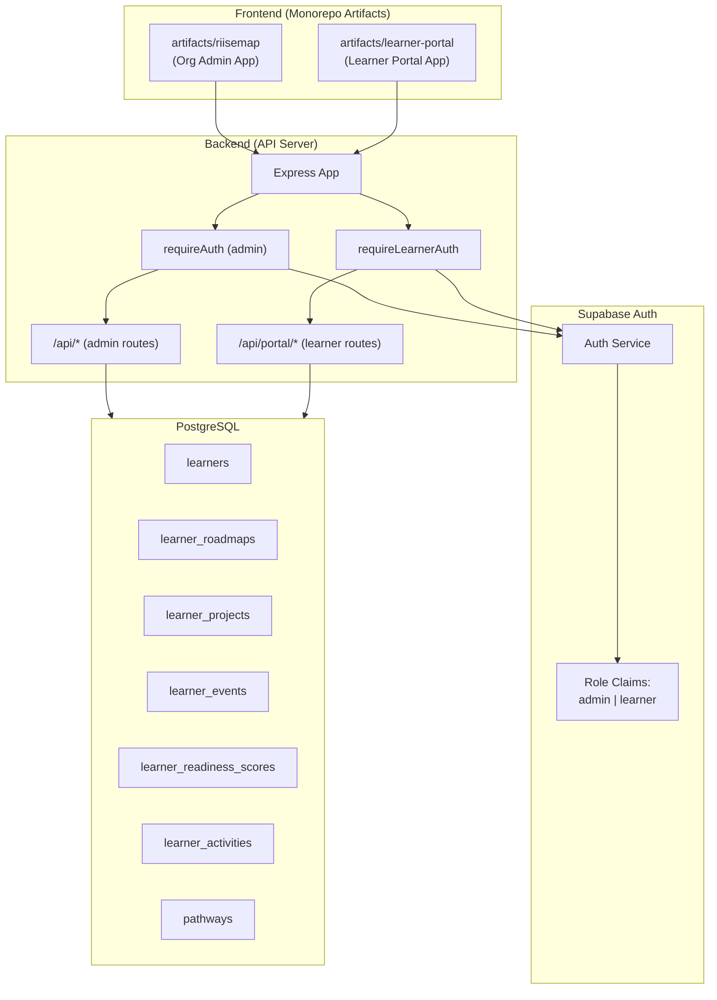
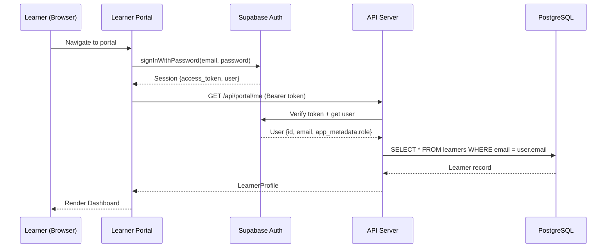
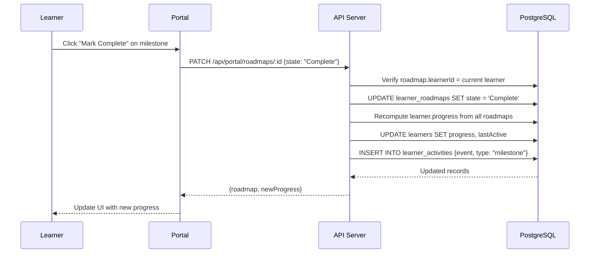
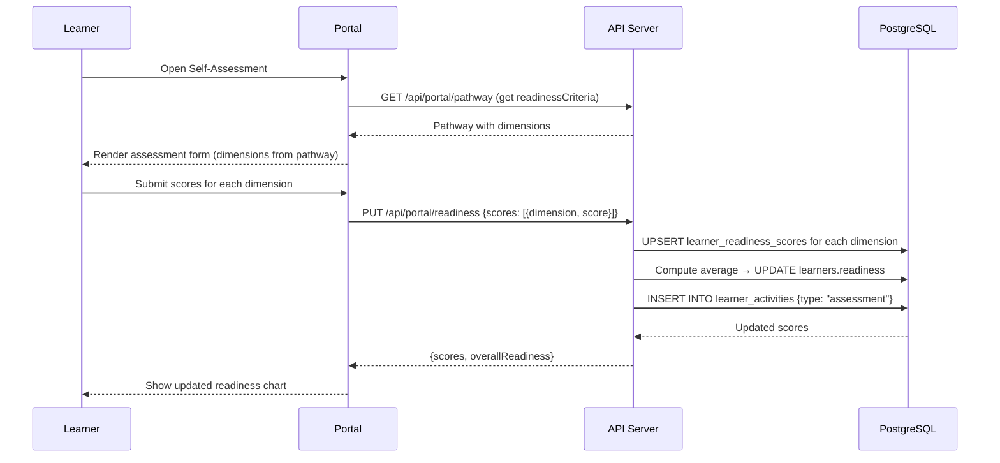

# Design Document: Learner Portal

## Overview

The Learner Portal is the learner-facing side of the Riise Map platform. While the existing system provides org-admins with dashboards, learner management, programs, pathways, and funding views, the learner portal gives individual learners a self-service interface to interact with their assigned pathway, complete milestones, update projects, attend events, and self-assess their readiness.

The portal will be implemented as a separate frontend artifact (`artifacts/learner-portal/`) within the existing monorepo, sharing the same backend API server but accessing learner-scoped endpoints. Authentication uses Supabase with role-based differentiation — learners authenticate with a `learner` role claim tied to their `learners.id` record. The API server gains a new `/api/portal` route namespace with middleware that enforces ownership (learners can only access their own data).

Progress, lastActive, and nextAction fields become computed/derived values rather than static strings, automatically updated as learners interact with the system.

## Architecture



## Sequence Diagrams

### Learner Authentication Flow



### Milestone Completion Flow



### Readiness Self-Assessment Flow



## Components and Interfaces

### Component 1: Learner Auth Middleware

**Purpose**: Validates that the request comes from an authenticated learner and attaches the learner record to the request.

```typescript
interface LearnerAuthRequest extends Request {
  learner: {
    id: number;
    name: string;
    email: string;
    pathway: string;
    program: string;
  };
  supabaseUser: {
    id: string;
    email: string;
    app_metadata: { role: "learner" };
  };
}
```

**Responsibilities**:
- Verify Bearer token with Supabase
- Confirm `app_metadata.role === "learner"`
- Look up the `learners` record by email
- Reject if no matching learner record exists
- Attach learner data to `req.learner`

### Component 2: Portal API Router

**Purpose**: Exposes learner-scoped endpoints under `/api/portal`. All operations are implicitly scoped to the authenticated learner.

```typescript
interface PortalRoutes {
  // Profile
  "GET /api/portal/me": () => LearnerProfile;
  "PUT /api/portal/me": (body: UpdateProfile) => LearnerProfile;

  // Pathway
  "GET /api/portal/pathway": () => PathwayDetail;

  // Roadmap
  "GET /api/portal/roadmaps": () => LearnerRoadmap[];
  "PATCH /api/portal/roadmaps/:id": (body: { state: string }) => RoadmapUpdateResult;

  // Projects
  "GET /api/portal/projects": () => LearnerProject[];
  "PATCH /api/portal/projects/:id": (body: ProjectUpdate) => LearnerProject;

  // Events
  "GET /api/portal/events": () => LearnerEvent[];
  "PATCH /api/portal/events/:id": (body: { status: string }) => LearnerEvent;

  // Readiness
  "GET /api/portal/readiness": () => LearnerReadinessScore[];
  "PUT /api/portal/readiness": (body: ReadinessSubmission) => ReadinessResult;

  // Activities
  "GET /api/portal/activities": () => LearnerActivity[];
}
```

**Responsibilities**:
- Scope all queries by `req.learner.id`
- Validate that modified resources belong to the learner
- Trigger derived computations (progress, lastActive, nextAction)
- Log activities on state-changing operations

### Component 3: Learner Portal Frontend

**Purpose**: A standalone React + Vite application that provides the learner experience.

```typescript
interface PortalPages {
  "/login": LoginPage;
  "/signup": SignupPage;
  "/": DashboardPage;        // overview with progress, next actions
  "/pathway": PathwayPage;    // milestones, projects, events
  "/projects": ProjectsPage;  // project details and updates
  "/readiness": ReadinessPage; // self-assessment
  "/profile": ProfilePage;    // edit profile
  "/activity": ActivityPage;  // timeline
}
```

**Responsibilities**:
- Supabase auth (sign up / sign in)
- Display learner dashboard with progress summary
- Allow milestone state transitions
- Allow project progress updates with evidence
- Render readiness assessment based on pathway criteria
- Display activity timeline
- Profile editing

### Component 4: Derived Value Computation Service

**Purpose**: Computes `progress`, `readiness`, `lastActive`, and `nextAction` from actual learner data rather than storing static values.

```typescript
interface DerivedComputations {
  computeProgress(learnerId: number): Promise<number>;
  computeReadiness(learnerId: number): Promise<number>;
  computeNextAction(learnerId: number): Promise<string>;
  updateLastActive(learnerId: number): Promise<void>;
  refreshLearnerDerivedFields(learnerId: number): Promise<void>;
}
```

**Responsibilities**:
- `progress` = (completed roadmap items / total roadmap items) × 100
- `readiness` = average of all `learner_readiness_scores.score`
- `lastActive` = current timestamp on any learner action
- `nextAction` = determined by first incomplete milestone or upcoming event
- Called after any state-changing portal action

## Data Models

### LearnerProfile (Portal Response)

```typescript
interface LearnerProfile {
  id: number;
  name: string;
  email: string;
  photo: string | null;
  background: string | null;
  strengths: string[] | null;
  pathway: string;
  program: string;
  coach: string;
  progress: number;         // computed
  readiness: number;        // computed
  status: string;
  lastActive: string;       // computed
  nextAction: string;       // computed
  joinDate: string;
}
```

**Validation Rules**:
- `name` is required, non-empty, max 255 chars
- `email` must be valid email format, immutable by learner
- `photo` is a URL string or null
- `strengths` is an array of strings (max 10 items, max 100 chars each)

### UpdateProfile (Portal Request)

```typescript
interface UpdateProfile {
  name?: string;
  photo?: string | null;
  background?: string | null;
  strengths?: string[];
}
```

**Validation Rules**:
- Learner cannot change: email, pathway, program, coach, status, progress, readiness
- Only profile-related fields are editable

### ProjectUpdate (Portal Request)

```typescript
interface ProjectUpdate {
  completion: number;
  status?: "Not Started" | "In Progress" | "Complete";
  evidenceUrl?: string;
  notes?: string;
}
```

**Validation Rules**:
- `completion` must be 0-100
- `status` transitions: Not Started → In Progress → Complete
- Cannot go backwards (Complete → In Progress is rejected)
- If `completion` reaches 100, `status` auto-sets to "Complete"

### ReadinessSubmission (Portal Request)

```typescript
interface ReadinessSubmission {
  scores: Array<{
    dimension: string;
    score: number;
  }>;
}
```

**Validation Rules**:
- `dimension` must match a dimension from the learner's pathway `readinessCriteria`
- `score` must be 1-5 (integer)
- All dimensions in the pathway's `readinessCriteria` must be scored

### RoadmapUpdateResult (Portal Response)

```typescript
interface RoadmapUpdateResult {
  roadmap: LearnerRoadmap;
  newProgress: number;
  nextAction: string;
}
```

## Algorithmic Pseudocode

### Progress Computation Algorithm

```typescript
async function computeProgress(learnerId: number): Promise<number> {
  // Precondition: learnerId exists in learners table
  const roadmaps = await db
    .select()
    .from(learnerRoadmapsTable)
    .where(eq(learnerRoadmapsTable.learnerId, learnerId));

  if (roadmaps.length === 0) return 0;

  const completed = roadmaps.filter(r => r.state === "Complete").length;
  return Math.round((completed / roadmaps.length) * 100);
  // Postcondition: result is 0-100 integer
}
```

### Next Action Computation Algorithm

```typescript
async function computeNextAction(learnerId: number): Promise<string> {
  // Precondition: learnerId exists in learners table

  // Priority 1: First incomplete milestone by due date
  const incompleteMilestones = await db
    .select()
    .from(learnerRoadmapsTable)
    .where(
      and(
        eq(learnerRoadmapsTable.learnerId, learnerId),
        ne(learnerRoadmapsTable.state, "Complete")
      )
    )
    .orderBy(learnerRoadmapsTable.dueDate)
    .limit(1);

  if (incompleteMilestones.length > 0) {
    return `Complete milestone: ${incompleteMilestones[0].title}`;
  }

  // Priority 2: In-progress projects
  const activeProjects = await db
    .select()
    .from(learnerProjectsTable)
    .where(
      and(
        eq(learnerProjectsTable.learnerId, learnerId),
        eq(learnerProjectsTable.status, "In Progress")
      )
    )
    .limit(1);

  if (activeProjects.length > 0) {
    return `Continue project: ${activeProjects[0].title}`;
  }

  // Priority 3: Upcoming events
  const upcomingEvents = await db
    .select()
    .from(learnerEventsTable)
    .where(
      and(
        eq(learnerEventsTable.learnerId, learnerId),
        eq(learnerEventsTable.status, "Upcoming")
      )
    )
    .limit(1);

  if (upcomingEvents.length > 0) {
    return `Attend event: ${upcomingEvents[0].title}`;
  }

  return "All caught up!";
  // Postcondition: returns a non-empty action string
}
```

### Readiness Upsert Algorithm

```typescript
async function upsertReadinessScores(
  learnerId: number,
  scores: Array<{ dimension: string; score: number }>
): Promise<void> {
  // Precondition: all dimensions exist in learner's pathway.readinessCriteria
  // Precondition: all scores are integers 1-5

  for (const { dimension, score } of scores) {
    const existing = await db
      .select()
      .from(learnerReadinessScoresTable)
      .where(
        and(
          eq(learnerReadinessScoresTable.learnerId, learnerId),
          eq(learnerReadinessScoresTable.dimension, dimension)
        )
      );

    if (existing.length > 0) {
      await db
        .update(learnerReadinessScoresTable)
        .set({ score })
        .where(eq(learnerReadinessScoresTable.id, existing[0].id));
    } else {
      await db
        .insert(learnerReadinessScoresTable)
        .values({ learnerId, dimension, score });
    }
  }

  // Recompute aggregate readiness
  const allScores = await db
    .select()
    .from(learnerReadinessScoresTable)
    .where(eq(learnerReadinessScoresTable.learnerId, learnerId));

  const avgReadiness = Math.round(
    allScores.reduce((sum, s) => sum + s.score, 0) / allScores.length
  );

  // Scale 1-5 to 0-100 for the learners.readiness field
  const scaledReadiness = Math.round((avgReadiness / 5) * 100);

  await db
    .update(learnersTable)
    .set({ readiness: scaledReadiness })
    .where(eq(learnersTable.id, learnerId));

  // Postcondition: learner_readiness_scores has one row per dimension
  // Postcondition: learners.readiness reflects the scaled average
}
```

### Activity Logging Algorithm

```typescript
async function logActivity(
  learnerId: number,
  event: string,
  type: "milestone" | "project" | "event" | "assessment" | "profile"
): Promise<void> {
  // Precondition: learnerId exists in learners table

  const now = new Date();
  const dateStr = now.toLocaleDateString("en-US", {
    month: "short",
    day: "numeric",
    year: "numeric",
  });

  await db.insert(learnerActivitiesTable).values({
    learnerId,
    date: dateStr,
    event,
    type,
  });

  // Update lastActive
  await db
    .update(learnersTable)
    .set({
      lastActive: dateStr,
    })
    .where(eq(learnersTable.id, learnerId));

  // Postcondition: new activity row exists
  // Postcondition: learners.lastActive is current date
}
```

## Key Functions with Formal Specifications

### Function: requireLearnerAuth

```typescript
async function requireLearnerAuth(
  req: Request,
  res: Response,
  next: NextFunction
): Promise<void>
```

**Preconditions:**
- `req.headers.authorization` starts with "Bearer "
- `SUPABASE_URL` and `SUPABASE_SERVICE_ROLE_KEY` are set

**Postconditions:**
- If valid token with `role === "learner"` and matching learner record: `req.learner` is populated, `next()` called
- If invalid/expired token: 401 response, `next()` not called
- If valid token but wrong role: 403 response
- If valid token but no learner record: 403 response with "Account not enrolled"

### Function: patchRoadmapState

```typescript
async function patchRoadmapState(
  learnerId: number,
  roadmapId: number,
  newState: string
): Promise<RoadmapUpdateResult>
```

**Preconditions:**
- `learnerId` exists in `learners` table
- `roadmapId` exists in `learner_roadmaps` with `learnerId` matching
- `newState` is one of: "Not Started", "In Progress", "Complete"

**Postconditions:**
- `learner_roadmaps[roadmapId].state` is updated to `newState`
- `learners[learnerId].progress` is recomputed
- `learners[learnerId].lastActive` is updated to now
- `learner_activities` has a new entry with type "milestone"
- Returns the updated roadmap and new progress percentage

**Loop Invariants:** N/A

### Function: updateProjectProgress

```typescript
async function updateProjectProgress(
  learnerId: number,
  projectId: number,
  update: ProjectUpdate
): Promise<LearnerProject>
```

**Preconditions:**
- `projectId` belongs to `learnerId`
- `update.completion` is integer 0-100
- If current status is "Complete", update is rejected (no regression)

**Postconditions:**
- `learner_projects[projectId].completion` is updated
- If `completion === 100`, status auto-set to "Complete"
- If `completion > 0` and status was "Not Started", status set to "In Progress"
- Activity logged with type "project"
- `lastActive` updated

**Loop Invariants:** N/A

## Example Usage

```typescript
// Example 1: Learner signs in and fetches their dashboard
const { data: { session } } = await supabase.auth.signInWithPassword({
  email: "learner@example.com",
  password: "securepass",
});

const profile = await fetch("/api/portal/me", {
  headers: { Authorization: `Bearer ${session.access_token}` },
}).then(r => r.json());

// profile: { id: 42, name: "Jane", progress: 65, nextAction: "Complete milestone: Week 4 Review", ... }

// Example 2: Mark a milestone complete
const result = await fetch("/api/portal/roadmaps/7", {
  method: "PATCH",
  headers: {
    Authorization: `Bearer ${token}`,
    "Content-Type": "application/json",
  },
  body: JSON.stringify({ state: "Complete" }),
}).then(r => r.json());

// result: { roadmap: {..., state: "Complete"}, newProgress: 75, nextAction: "Continue project: Capstone" }

// Example 3: Submit readiness self-assessment
const result = await fetch("/api/portal/readiness", {
  method: "PUT",
  headers: {
    Authorization: `Bearer ${token}`,
    "Content-Type": "application/json",
  },
  body: JSON.stringify({
    scores: [
      { dimension: "Communication", score: 4 },
      { dimension: "Technical Skills", score: 3 },
      { dimension: "Professionalism", score: 5 },
    ],
  }),
}).then(r => r.json());

// result: { scores: [...], overallReadiness: 80 }

// Example 4: Update project progress
await fetch("/api/portal/projects/12", {
  method: "PATCH",
  headers: {
    Authorization: `Bearer ${token}`,
    "Content-Type": "application/json",
  },
  body: JSON.stringify({ completion: 85, notes: "Submitted draft to mentor" }),
});
```

## Correctness Properties

*A property is a characteristic or behavior that should hold true across all valid executions of a system — essentially, a formal statement about what the system should do. Properties serve as the bridge between human-readable specifications and machine-verifiable correctness guarantees.*

### Property 1: Ownership Isolation

*For any* request to `/api/portal/*` by an authenticated learner, all data in the response SHALL have `resource.learnerId` equal to the authenticated learner's ID, and any request for a resource belonging to a different learner SHALL return 404.

**Validates: Requirements 3.1, 3.2, 3.3**

### Property 2: Progress Consistency

*For any* learner with roadmap items, the learner's `progress` field SHALL equal `round((count(roadmaps where state="Complete") / count(all roadmaps)) * 100)`, and SHALL be 0 when no roadmap items exist. Progress is recomputed immediately after any roadmap state change.

**Validates: Requirements 6.4, 11.2**

### Property 3: Readiness Consistency

*For any* learner with readiness scores (each in range 1–5), the learner's `readiness` field SHALL equal `round((average(scores) / 5) * 100)`, producing a value in the range 0–100. Readiness is recomputed immediately after any self-assessment submission.

**Validates: Requirements 9.5, 11.3**

### Property 4: Activity Completeness and LastActive Freshness

*For any* state-changing portal action (roadmap update, project update, event update, readiness submission, or profile edit), the system SHALL insert an activity record in `learner_activities` with the correct learnerId, event description, type, and current date, AND SHALL update the learner's `lastActive` field to the current date.

**Validates: Requirements 6.6, 7.7, 8.3, 9.6, 11.1, 11.5**

### Property 5: No Project Status Regression

*For any* project with status "Complete", any PATCH request attempting to set the status to "In Progress" or "Not Started" SHALL be rejected with 400 status. Project status transitions are monotonically forward-only.

**Validates: Requirements 7.4**

### Property 6: Score Bounds Enforcement

*For any* readiness score submitted via the portal, the score value SHALL be an integer in the range 1–5 inclusive. Any score outside this range SHALL be rejected with 400 status.

**Validates: Requirements 9.3, 13.4**

### Property 7: Dimension Validity

*For any* readiness submission, each submitted `dimension` string SHALL exist in the learner's pathway `readinessCriteria` array. Any dimension not in the pathway criteria SHALL cause rejection with 400 status.

**Validates: Requirements 9.4**

### Property 8: Completion Bounds Enforcement

*For any* project completion value submitted via the portal, the value SHALL be an integer in the range 0–100 inclusive. Any value outside this range SHALL be rejected with 400 status.

**Validates: Requirements 7.2, 7.3, 13.3**

### Property 9: Project Auto-Status Transitions

*For any* project update where completion reaches 100, the project status SHALL automatically be set to "Complete". *For any* project with status "Not Started" where completion changes to a value greater than 0, the project status SHALL automatically be set to "In Progress".

**Validates: Requirements 7.5, 7.6**

### Property 10: NextAction Priority Algorithm

*For any* learner, the `nextAction` field SHALL be determined by priority: (1) first incomplete milestone ordered by due date, (2) if no incomplete milestones exist, first in-progress project, (3) if no in-progress projects exist, first upcoming event, (4) if none of the above exist, the string "All caught up!".

**Validates: Requirements 6.5, 11.4**

### Property 11: Profile Immutability

*For any* profile update request, the fields email, pathway, program, coach, status, progress, and readiness SHALL remain unchanged regardless of what values are submitted. Only permitted fields (name, photo, background, strengths) SHALL be modifiable.

**Validates: Requirements 4.2, 4.3**

### Property 12: Readiness Upsert Idempotence

*For any* valid readiness submission, submitting the same set of scores twice in succession SHALL produce the same final state in `learner_readiness_scores` — the second submission updates existing rows rather than creating duplicates, and the computed `readiness` value is identical after both submissions.

**Validates: Requirements 9.2**

## Error Handling

### Error Scenario 1: Unauthenticated Access

**Condition**: Request to `/api/portal/*` without valid Bearer token
**Response**: 401 `{ error: "Missing authorization token" }` or `{ error: "Invalid or expired token" }`
**Recovery**: Client redirects to login page, clears stale session

### Error Scenario 2: Wrong Role

**Condition**: Admin user attempts to access `/api/portal/*`
**Response**: 403 `{ error: "Learner access required" }`
**Recovery**: Client shows "Access denied" message, no recovery path (admins use the admin app)

### Error Scenario 3: Not Enrolled

**Condition**: User has valid learner Supabase account but no matching `learners` record
**Response**: 403 `{ error: "Account not enrolled. Contact your program administrator." }`
**Recovery**: Learner contacts admin; admin creates learner record and associates it

### Error Scenario 4: Resource Not Found / Not Owned

**Condition**: Learner requests a roadmap/project/event ID that doesn't exist or belongs to another learner
**Response**: 404 `{ error: "Resource not found" }`
**Recovery**: Client refreshes the list from server

### Error Scenario 5: Invalid State Transition

**Condition**: Learner tries to regress project status (Complete → In Progress)
**Response**: 400 `{ error: "Cannot revert completed project" }`
**Recovery**: Client shows validation message, no action taken

### Error Scenario 6: Invalid Readiness Dimensions

**Condition**: Submitted dimensions don't match pathway's readinessCriteria
**Response**: 400 `{ error: "Invalid dimensions", expected: [...], received: [...] }`
**Recovery**: Client re-fetches pathway criteria and presents correct form

## Testing Strategy

### Unit Testing Approach

- Test derived computation functions in isolation (computeProgress, computeNextAction, computeReadiness)
- Mock database layer for route handler tests
- Validate request body parsing with Zod schemas
- Test state transition logic (project status, roadmap state)

### Property-Based Testing Approach

**Property Test Library**: fast-check

Key properties to test:
- For any combination of roadmap states, `computeProgress` always returns 0-100
- For any valid score submission (1-5 per dimension), readiness is always 0-100
- Ownership scoping: generated learner IDs never leak into other learner's responses
- State machine: project status transitions are monotonic (forward-only)

### Integration Testing Approach

- End-to-end flow: sign up → profile completion → milestone update → verify progress changed
- Auth middleware integration: valid token, expired token, wrong role, missing learner record
- Concurrent access: two learners updating simultaneously don't interfere
- API contract tests: portal endpoints match the OpenAPI spec generated by Orval

## Performance Considerations

- **Derived field computation**: Progress/readiness recomputation runs on every state change. For learners with many roadmaps (50+), this is still fast (single aggregate query). No caching needed initially.
- **Activity log pagination**: `/api/portal/activities` should support `?limit=20&offset=0` to avoid loading full history.
- **Pathway data**: Pathway details (milestones, skills, readinessCriteria) are JSONB and read-only for learners. Cache at frontend layer with TanStack Query (staleTime: 5 minutes).
- **Database indexes**: Ensure indexes on `learner_roadmaps.learnerId`, `learner_projects.learnerId`, `learner_events.learnerId`, `learner_readiness_scores.learnerId`, `learner_activities.learnerId`, and `learners.email`.

## Security Considerations

- **Row-Level Isolation**: Every portal query includes `WHERE learnerId = req.learner.id`. No endpoint exposes list-all semantics.
- **Token Validation**: Every request is validated against Supabase Auth with the service role key (server-side only).
- **Role Separation**: `app_metadata.role` is set server-side during enrollment. Learners cannot self-assign admin role.
- **Input Validation**: All request bodies validated via Zod schemas. Score bounds (1-5), completion bounds (0-100), string lengths enforced.
- **No PII Leakage**: Portal only returns the authenticated learner's own data. Email uniqueness checks don't reveal existence of other accounts.
- **Rate Limiting**: Consider adding rate limiting to assessment and milestone endpoints to prevent automated abuse.
- **CORS**: Portal frontend has its own origin; API CORS config should allow both admin and portal origins.

## Dependencies

- **Existing**: Express, Drizzle ORM, PostgreSQL, Supabase Auth, TanStack Query, wouter, shadcn/ui, Vite, Orval
- **New frontend artifact**: `artifacts/learner-portal/` — React + Vite + TanStack Query + shadcn/ui + wouter (same stack as admin, separate build)
- **New shared lib** (optional): `lib/portal-api-client-react/` — Orval-generated hooks for portal endpoints
- **Schema changes**: Add `supabaseUid` column to `learners` table for direct user→learner mapping (alternative to email lookup)
- **Supabase config**: New role claim (`learner`) in `app_metadata`, separate sign-up flow for learners
