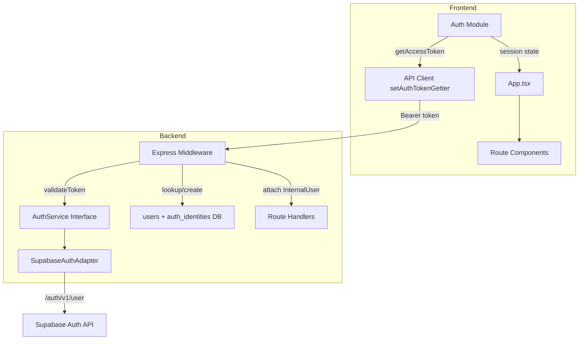
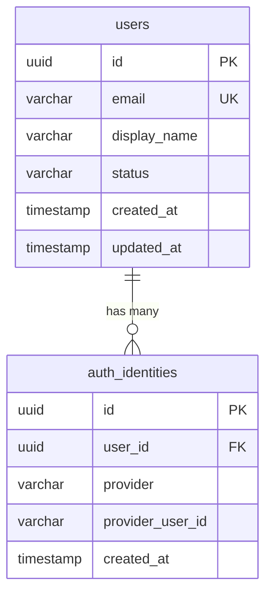

# Design Document: Provider-Neutral Identity

## Overview

This design introduces a provider-neutral identity layer to the RiiseMap Admin application. The current system has no internal user model — identity lives entirely in Supabase's `auth.users` table, and both frontend and backend are directly coupled to Supabase APIs. This design adds:

1. An internal `users` table and `auth_identities` linking table in PostgreSQL (via Drizzle ORM)
2. A server-side `AuthService` interface with a Supabase adapter (swappable for Cognito later)
3. Updated Express middleware that validates tokens via the abstraction and resolves an internal user
4. A frontend auth module that isolates all Supabase client calls behind a provider-agnostic API
5. A migration strategy for the existing single user (info@techsofcolor.org)

The design prioritizes minimal disruption — the token flow stays the same (Bearer JWT from Supabase), but the backend now resolves tokens to an internal user record rather than passing raw Supabase user objects to route handlers.

## Architecture



**Key architectural decisions:**

1. **Interface + Adapter pattern**: The `AuthService` is a single-method interface. Swapping providers means implementing a new adapter and changing the `AUTH_PROVIDER` env var — no middleware or route handler changes.

2. **Auto-provisioning on first login**: Rather than a separate registration flow, the middleware creates the internal user record on first successful token validation. This keeps the MVP simple.

3. **Schema in lib/db**: The new tables follow existing patterns — defined in `lib/db/src/schema/index.ts`, using Drizzle's `pgTable`, `uuid`, timestamps, and Zod insert schemas.

4. **Frontend stays Supabase-aware at the auth boundary**: The auth module still uses `@supabase/supabase-js` internally, but exports a provider-agnostic surface (getAccessToken, signIn, signOut, onAuthStateChange). App.tsx and route components consume only this surface.

## Components and Interfaces

### 1. AuthService Interface (`artifacts/api-server/src/lib/auth-service.ts`)

```typescript
export interface AuthResult {
  providerUserId: string;
  email: string;
  provider: string; // "supabase" | "cognito" | ...
}

export interface AuthService {
  validateToken(token: string): Promise<AuthResult>;
}

export class AuthValidationError extends Error {
  constructor(message: string) {
    super(message);
    this.name = "AuthValidationError";
  }
}
```

### 2. Supabase Adapter (`artifacts/api-server/src/lib/supabase-auth-adapter.ts`)

```typescript
import type { AuthService, AuthResult } from "./auth-service";
import { AuthValidationError } from "./auth-service";

export class SupabaseAuthAdapter implements AuthService {
  constructor(
    private supabaseUrl: string,
    private serviceRoleKey: string,
  ) {}

  async validateToken(token: string): Promise<AuthResult> {
    const response = await fetch(`${this.supabaseUrl}/auth/v1/user`, {
      headers: {
        Authorization: `Bearer ${token}`,
        apikey: this.serviceRoleKey,
      },
    });

    if (!response.ok) {
      throw new AuthValidationError("Invalid or expired token");
    }

    const user = await response.json();
    return {
      providerUserId: user.id,
      email: user.email,
      provider: "supabase",
    };
  }
}
```

### 3. Auth Factory (`artifacts/api-server/src/lib/auth-factory.ts`)

```typescript
import type { AuthService } from "./auth-service";
import { SupabaseAuthAdapter } from "./supabase-auth-adapter";

export function createAuthService(): AuthService {
  const provider = process.env.AUTH_PROVIDER || "supabase";

  switch (provider) {
    case "supabase": {
      const url = process.env.SUPABASE_URL;
      const key = process.env.SUPABASE_SERVICE_ROLE_KEY;
      if (!url || !key) {
        throw new Error("SUPABASE_URL and SUPABASE_SERVICE_ROLE_KEY must be set");
      }
      return new SupabaseAuthAdapter(url, key);
    }
    default:
      throw new Error(`Unknown AUTH_PROVIDER: ${provider}`);
  }
}
```

### 4. Updated Middleware (`artifacts/api-server/src/middlewares/auth.ts`)

```typescript
import type { Request, Response, NextFunction } from "express";
import { db } from "@workspace/db";
import { usersTable, authIdentitiesTable } from "@workspace/db/schema";
import { eq, and } from "drizzle-orm";
import { createAuthService } from "../lib/auth-factory";
import { AuthValidationError } from "../lib/auth-service";

const authService = createAuthService();

export interface RequestUser {
  id: string;       // internal UUID
  email: string;
  status: string;
}

declare global {
  namespace Express {
    interface Request {
      user?: RequestUser;
    }
  }
}

export async function requireAuth(req: Request, res: Response, next: NextFunction) {
  if (req.method === "OPTIONS") return next();

  const authHeader = req.headers.authorization;
  if (!authHeader?.startsWith("Bearer ")) {
    return res.status(401).json({ error: "Missing authorization token" });
  }

  const token = authHeader.slice(7);

  try {
    // 1. Validate token with provider
    const authResult = await authService.validateToken(token);

    // 2. Look up internal user by provider identity
    let identity = await db.query.authIdentitiesTable.findFirst({
      where: and(
        eq(authIdentitiesTable.provider, authResult.provider),
        eq(authIdentitiesTable.providerUserId, authResult.providerUserId),
      ),
    });

    let user;
    if (identity) {
      user = await db.query.usersTable.findFirst({
        where: eq(usersTable.id, identity.userId),
      });
    }

    // 3. Auto-provision on first login
    if (!user) {
      const result = await db.transaction(async (tx) => {
        const [newUser] = await tx.insert(usersTable).values({
          email: authResult.email,
          displayName: null,
          status: "active",
        }).returning();

        await tx.insert(authIdentitiesTable).values({
          userId: newUser.id,
          provider: authResult.provider,
          providerUserId: authResult.providerUserId,
        });

        return newUser;
      });
      user = result;
    }

    // 4. Check user status
    if (user.status === "suspended" || user.status === "deactivated") {
      return res.status(403).json({ error: "Account is not active" });
    }

    // 5. Attach internal user to request
    req.user = {
      id: user.id,
      email: user.email,
      status: user.status,
    };
  } catch (err) {
    if (err instanceof AuthValidationError) {
      return res.status(401).json({ error: err.message });
    }
    return res.status(401).json({ error: "Auth verification failed" });
  }

  next();
}
```

### 5. Frontend Auth Module (`artifacts/riisemap/src/lib/auth.ts`)

```typescript
import { supabase } from "./supabase";
import type { Session, Subscription } from "@supabase/supabase-js";

export interface AuthState {
  authenticated: boolean;
  accessToken: string | null;
  email: string | null;
}

export async function getAccessToken(): Promise<string | null> {
  const { data: { session } } = await supabase.auth.getSession();
  return session?.access_token ?? null;
}

export async function signIn(email: string, password: string) {
  return supabase.auth.signInWithPassword({ email, password });
}

export async function signOut() {
  return supabase.auth.signOut();
}

export async function getSession(): Promise<Session | null> {
  const { data: { session } } = await supabase.auth.getSession();
  return session;
}

export function onAuthStateChange(
  callback: (session: Session | null) => void,
): { unsubscribe: () => void } {
  const { data: { subscription } } = supabase.auth.onAuthStateChange(
    (_event, session) => callback(session),
  );
  return { unsubscribe: () => subscription.unsubscribe() };
}
```

## Data Models

### Database Schema (Drizzle definitions in `lib/db/src/schema/index.ts`)

```typescript
import { pgTable, uuid, varchar, timestamp } from "drizzle-orm/pg-core";
import { createInsertSchema } from "drizzle-zod";
import { z } from "zod";

// Users Table
export const usersTable = pgTable("users", {
  id: uuid("id").defaultRandom().primaryKey(),
  email: varchar("email", { length: 255 }).notNull().unique(),
  displayName: varchar("display_name", { length: 255 }),
  status: varchar("status", { length: 50 }).notNull().default("active"),
  createdAt: timestamp("created_at", { withTimezone: true }).defaultNow().notNull(),
  updatedAt: timestamp("updated_at", { withTimezone: true }).defaultNow().notNull(),
});

export const insertUserSchema = createInsertSchema(usersTable).omit({
  id: true,
  createdAt: true,
  updatedAt: true,
});
export type InsertUser = z.infer<typeof insertUserSchema>;
export type User = typeof usersTable.$inferSelect;

// Auth Identities Table
export const authIdentitiesTable = pgTable("auth_identities", {
  id: uuid("id").defaultRandom().primaryKey(),
  userId: uuid("user_id").notNull().references(() => usersTable.id, { onDelete: "cascade" }),
  provider: varchar("provider", { length: 50 }).notNull(),
  providerUserId: varchar("provider_user_id", { length: 255 }).notNull(),
  createdAt: timestamp("created_at", { withTimezone: true }).defaultNow().notNull(),
});

export const insertAuthIdentitySchema = createInsertSchema(authIdentitiesTable).omit({
  id: true,
  createdAt: true,
});
export type InsertAuthIdentity = z.infer<typeof insertAuthIdentitySchema>;
export type AuthIdentity = typeof authIdentitiesTable.$inferSelect;
```

**Unique constraint**: A unique index on `(provider, provider_user_id)` ensures no two internal users can be linked to the same external identity. Drizzle supports this via `.unique()` on the table definition or a separate `uniqueIndex`.

```typescript
import { uniqueIndex } from "drizzle-orm/pg-core";

// Added to authIdentitiesTable definition or as a standalone:
export const providerIdentityIdx = uniqueIndex("auth_identities_provider_provider_user_id_idx")
  .on(authIdentitiesTable.provider, authIdentitiesTable.providerUserId);
```

### Entity Relationships



### Migration Strategy for Existing User

A one-time seed/migration script will:
1. Query Supabase for the existing user (info@techsofcolor.org) to get their Supabase UUID
2. Insert a record in `users` with that email
3. Insert a record in `auth_identities` linking the new internal user to the Supabase UUID with provider="supabase"

This runs as part of the initial `drizzle-kit push` deployment. The script is idempotent — it checks if the user already exists before inserting.


## Correctness Properties

*A property is a characteristic or behavior that should hold true across all valid executions of a system — essentially, a formal statement about what the system should do. Properties serve as the bridge between human-readable specifications and machine-verifiable correctness guarantees.*

### Property 1: Unique constraint on provider identity

*For any* two auth identity records with the same `provider` and `provider_user_id` values, the database SHALL reject the second insertion, ensuring no external identity maps to more than one internal user.

**Validates: Requirements 1.3**

### Property 2: Auto-provisioning creates linked records

*For any* valid AuthResult (containing a provider, providerUserId, and email) where no matching auth_identity record exists, the middleware SHALL create exactly one new user record and one new auth_identity record, and the auth_identity's `user_id` SHALL reference the newly created user's `id`.

**Validates: Requirements 1.4, 3.3**

### Property 3: User resolution correctness

*For any* valid token that maps to an existing auth_identity record, the middleware SHALL resolve the corresponding internal user and attach the correct `id`, `email`, and `status` to the request object — meaning the attached values exactly match the stored user record.

**Validates: Requirements 3.2, 3.4**

### Property 4: Status-based access rejection

*For any* internal user whose `status` is "suspended" or "deactivated", when a valid token resolves to that user, the middleware SHALL reject the request with HTTP 403 and SHALL NOT attach user data to the request.

**Validates: Requirements 3.5**

### Property 5: Multiple identities resolve to same user

*For any* internal user with N auth_identity records (N ≥ 2) across different providers, resolving any of those provider identities SHALL yield the same internal user `id`.

**Validates: Requirements 1.5**

## Error Handling

### Token Validation Errors

| Scenario | Response | Details |
|----------|----------|---------|
| Missing Authorization header | 401 | `{ error: "Missing authorization token" }` |
| Malformed Bearer token | 401 | `{ error: "Missing authorization token" }` |
| Expired/invalid token (provider rejects) | 401 | `{ error: "Invalid or expired token" }` |
| Provider API unreachable | 401 | `{ error: "Auth verification failed" }` |
| User status suspended/deactivated | 403 | `{ error: "Account is not active" }` |

### Auto-Provisioning Errors

- **Race condition on concurrent first-login**: If two requests with the same provider identity arrive simultaneously, the unique constraint on `(provider, provider_user_id)` prevents duplicate creation. The second transaction will fail and retry by looking up the now-existing record.
- **Database unavailable during provisioning**: Returns 500 with generic error. The token was valid, so a retry will succeed once the DB recovers.

### Frontend Error Handling

- **Token refresh failure**: The Supabase client handles token refresh automatically. If refresh fails, `getAccessToken()` returns null, the API client sends no Bearer header, and the backend returns 401 — triggering the frontend to redirect to Login.
- **Sign-out errors**: Silently handled — local state is cleared regardless of whether the Supabase signOut API call succeeds.

## Testing Strategy

### Unit Tests

- **Auth factory**: Verify correct adapter instantiation for known providers, default to "supabase", throw for unknown.
- **Supabase adapter**: Mock `fetch` to simulate Supabase responses — verify AuthResult extraction on success, AuthValidationError on failure.
- **Middleware user resolution**: Mock AuthService and database queries to test the lookup → auto-provision → status-check → attach flow with concrete examples.
- **Frontend auth module**: Mock `supabase.auth` methods, verify getAccessToken returns token string, signIn/signOut delegate correctly.

### Property-Based Tests

Property-based testing applies to the core middleware resolution logic, which is pure input/output behavior over varying inputs (different emails, provider IDs, user statuses).

- **Library**: [fast-check](https://github.com/dubzzz/fast-check) (TypeScript PBT library, widely used in the ecosystem)
- **Minimum iterations**: 100 per property
- **Tag format**: `Feature: provider-neutral-identity, Property {N}: {description}`

Each property test will:
1. Generate random valid inputs (emails, UUIDs, provider names, statuses)
2. Exercise the resolution logic against an in-memory or mocked data layer
3. Assert the universal property holds for all generated inputs

Properties to implement:
- Property 1 (unique constraint): Generate random (provider, providerUserId) pairs, insert, attempt duplicate, verify rejection
- Property 2 (auto-provisioning): Generate random AuthResults with no existing user, verify both records created and linked
- Property 3 (resolution correctness): Generate random existing users + identities, resolve, verify attached data matches
- Property 4 (status rejection): Generate random users with non-active status, verify 403
- Property 5 (multiple identities): Generate random users with multiple identities, resolve each, verify same user ID

### Integration Tests

- **End-to-end auth flow**: Real Supabase token → middleware → DB lookup → response with internal user context
- **Migration script**: Verify existing user (info@techsofcolor.org) is correctly seeded into users + auth_identities tables
- **Provider switch simulation**: Set AUTH_PROVIDER to unknown value, verify startup fails with clear error

